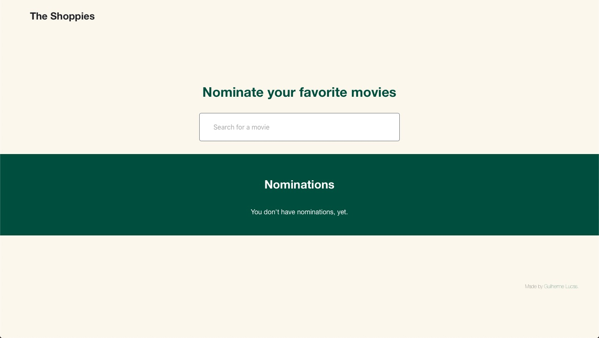

# the-shoppies

Movie nomination website created as part of the application process for the Shopify Front-End Developer Internship.

# [🔗 View Deployed Version](https://the-shoppies-mu.vercel.app)

## Table Of Contents

- [The Challenge](#The-Challenge)
- [Tech Used](#Tech-Used)
- [Future Improvements](#Future-Improvements)

---

## The Challenge

Create a webpage that can search OMDB for movies, and allow the user to save their favourite films they feel should be up for nomination. When they've selected 5 nominees they should be notified they're finished.

### Requirements

- Simple to use interface.
- The ability search the OMDB API and return a list of movies that show at least the title, release year and a button to nominate them.
- Search results should only be of movies.
- Updates to the search terms should update the result list.
- If a movie has been nominated already, it's button should be disabled within in search results.
- Nominated movies should move to their own "Nomination List".
- Movies in the nomination list should be able to be removed.
- Display a banner when the user has 5 nominations.

### Extras

- Improve the design of the example.
- Save nomination lists if the user leaves the page.

---

## Tech Used

- React.js (Hooks)
- OMDB API
- CSS Modules
- CSS Grids
- Flexbox
- Local Storage

---

## Future Improvements

- Creating test for all the app.
- Animations to elements.
- Change the app to TypeScript.

[Back To Top](#Table-Of-Contents)
